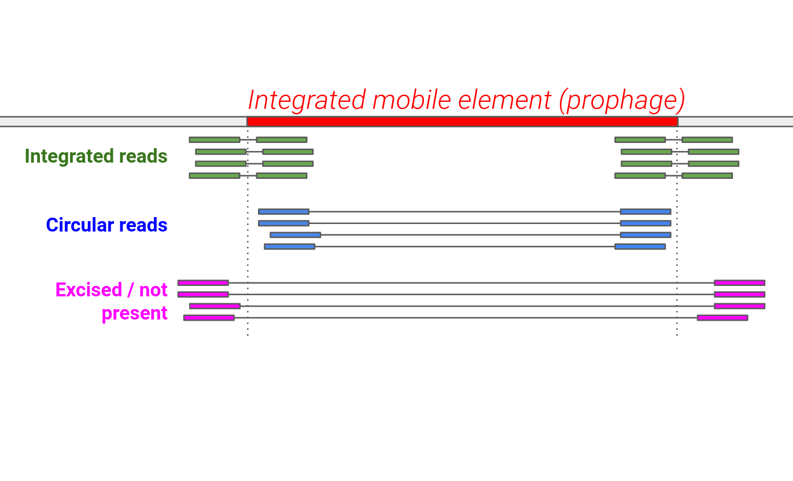

# Mobile Element Integration Quantification

This is a quick script that quantifies different categories of reads at the edges of mobile elements in a set of metagenomic samples (mapped BAM files). This script requires paired Illumina reads to be mapped to a genome / contig of interest with a known mobile genetic element (e.g. a prophage) integrated into it, with known coordinates. The pairs must have a reasonable insert size and not be entirely overlapping in the sample. The coverages of the genetic element and the genome will be reported, along with the following read types:



```
usage: count_read_distances.py [-h] -b BAM_FILE_DIRECTORY -c CONTIG -s START -e END [-r READ_LENGTH] [-i MAX_INSERT_LENGTH]

Pipeline for detecting Illumina read pairs that can be used to infer if a prophage or mobile element is active, integrated, or excised from a host genome.

optional arguments:
  -h, --help            show this help message and exit
  -b BAM_FILE_DIRECTORY, --bam_file_directory BAM_FILE_DIRECTORY
                        Directory of cleaned and processed FASTQ files
  -c CONTIG, --contig CONTIG
                        Contig containing the integrated mobile element.
  -s START, --start START
                        Starting position (bp) of the integrated mobile element / prophage in the contig.
  -e END, --end END     Ending position (bp) of the integrated mobile element / prophage in the contig.
  -r READ_LENGTH, --read_length READ_LENGTH
                        Sequencing read length (either 150 or 75 bp)
  -i MAX_INSERT_LENGTH, --max_insert_length MAX_INSERT_LENGTH
                        max_insert_length
```

Output:
```
Sample	Genome_coverage	Mge_coverage	Integrated_reads	Circular_reads	Excised_reads
```
